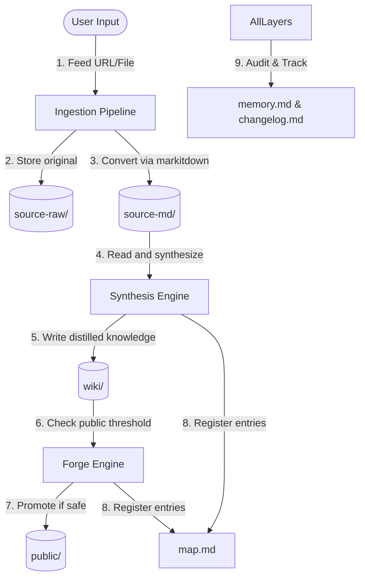

# Jarvis - Software Architecture

This document describes the software architecture, repository organization, and technical workflow rules for the Jarvis wiki engine.

## Repository Overview

Jarvis is a markdown-based knowledge management system designed for multi-agent ingestion, synthesis, and publishing.

```
Source (URL/File/Text) → source-raw/ → source-md/ → wiki/ → public/
                                    ↑           ↑
                                markitdown   synthesis
```

## Core Modules & Data Pipeline

### 1. Ingestion Pipeline
- **Inputs:** Raw files (HTML, DOCX, PPTX, PDF, or text) or URLs.
- **Processing:** Converted to clean markdown via `markitdown` and saved into `source-md/` with date-prefixed filenames (`YYYYMMDD-slug.md`).
- **Media Extraction:** Any embedded assets (images, gifs) are extracted to `source-md/assets/YYYYMMDD-slug/`.

### 2. Synthesis Engine
- **Processing:** Converted markdown in `source-md/` is analyzed by an AI agent. The agent synthesizes and structures knowledge into `wiki/` pages based on domain hierarchy.
- **Granularity:** One file per distinct topic. Small subtopics remain as sections.
- **Cross-Linking:** Wikilinks (`[[slug]]`) are verified and updated to maintain a high-density, navigable web of documents.

### 3. Public Promotion (Forge)
- **Processing:** High-fidelity, polished, non-sensitive pages are promoted to `public/`.
- **Privacy Enforcement:** Strict checks ensure zero project-specific or personally identifiable information is leaked to public pages.

## Directory Layout Mapping

| Directory / File | Role in Architecture |
|---|---|
| `source-raw/` | **Storage Layer (Input):** Contains the original, unaltered raw source files (HTML, PDF, DOCX, PPTX, etc.) ingested from URLs or local paths. |
| `source-md/` | **Representation Layer:** Holds the standard Markdown conversions produced by the `markitdown` converter, using `YYYYMMDD-slug.md` names. Contains a nested `assets/` folder for extracted source media. |
| `wiki/` | **Distilled Knowledge Vault:** The core domain-organized knowledge pages. Each page represents a compiled topic summary. Sibling `assets/` directories hold referenced images. |
| `public/` | **Publication Layer (Output):** The polished, non-sensitive versions of wiki pages promoted for external sharing. |
| `temp/` | **Error / Staging Vault:** Staging files or inputs that failed conversion for developer inspection. |
| `map.md` | **System Registry:** Central index tracking the ingestion status, file names, summaries, and source lineages. |
| `agents.md` | **Agent Orchestrator Configuration:** The master operations manual directing all AI agent actions. |
| `design.md` | **Design System Specifications:** The guidelines for visual and layout formatting. |
| `setup.md` | **Bootstrap/Environment Config:** Instructions and scripts to configure dependencies and local folders. |
| `tasks.md` | **Workspace Task Ledger:** The shared checklist for agents to track current progress. |
| `plan.md` | **Workspace Implementation Workspace:** Proposal scratchpad for drafting plans before user approval. |
| `memory.md` | **Persistent Workspace Context:** Stores preferences, guidelines, and historical decisions across runs. |
| `changelog.md` | **Audit Trail:** Append-only logs showing agent run history. |

## Module Communication & Data Flow



1. **Ingestion Pipeline:** Reads external files and writes the original version to `source-raw/`, and the converted `.md` text to `source-md/`. Embedded media inside files are extracted to `source-md/assets/`.
2. **Registry Mapping:** The Ingestion pipeline immediately catalogs new files in `map.md`.
3. **Synthesis Engine:** The agent reads from `source-md/` and writes/updates compiled files in `wiki/`. Sibling images referenced are copied from `source-md/assets/` to `wiki/.../assets/`.
4. **Promotion Pipeline (Forge):** The agent compares new/updated `wiki/` pages against the safety threshold (no PII or project details) and mirrors them to `public/` if compliant.
5. **System Tracking:** All pipelines write run context changes to `memory.md` and append events to `changelog.md` upon completion.
